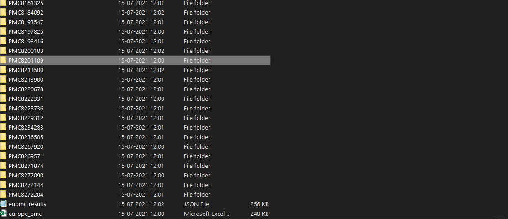
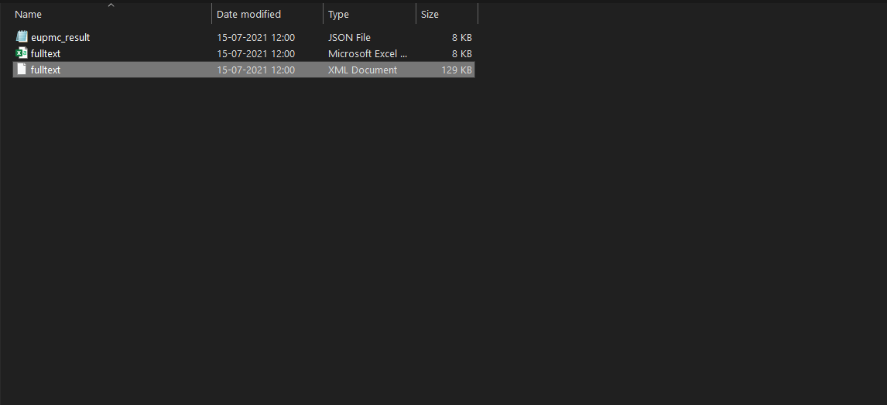

<p align="center">
  
  <h2 align="center">Research Papers right from python</h2>
</p>

# What is pygetpapers


- pygetpapers is a tool to assist text miners. It makes requests to open access scientific text repositories, analyses the hits, and systematically downloads the articles without further interaction.

- Comes with the packages `pygetpapers` and `downloadtools` which provide various functions to download, process and save research papers and their metadata.

- The main medium of its interaction with users is through a command-line interface.

- `pygetpapers` has a modular design which makes maintenance easy and simple. This also allows adding support for more repositories simple.

<br>
<p>
<a href="https://github.com/petermr/pygetpapers/actions"></a>
<a href="https://github.com/petermr/pygetpapers/issues"></a>
<a href="https://github.com/petermr/pygetpapers/issues?q=is%3Aclosed"></a>
<a href="https://github.com/petermr/pygetpapers/commits/main"></a>
<a href="https://github.com/petermr/pygetpapers/stargazers"></a>
<a href='https://pygetpapers.readthedocs.io/en/latest/?badge=latest'>
    
</a>
</p>

<p align="center">
  
</p>

<p>
The developer documentation has been setup at <a href="https://pygetpapers.readthedocs.io/en/latest/#">readthedocs</a>
</p>

# History

`getpapers` is a tool written by Rik Smith-Unna funded by ContentMine at https://github.com/ContentMine/getpapers. The OpenVirus community requires a Python version and Ayush Garg has written an implementation from scratch, with some enhancements.

# Formats supported by pygetpapers

- pygetpapers gives fulltexts in xml and pdf format. 
- The metadata for papers can be saved in many formats including JSON, CSV, HTML.
- Queries can be saved in form of an ini configuration file. 
- The additional files for papers can also be downloaded. References and citations for papers are given in XML format. 
- Log files can be saved in txt format.

# Repository Structure

The main code is located in the pygetpapers directory. All the supporting modules for different repositories are described in the pygetpapers/repository directory.

# Architecture

<p align="center">

</p>

# About the author and community

`pygetpapers` has been developed by Ayush Garg under the dear guidance of the OpenVirus community and Peter Murray Rust. Ayush is currently a high school student who believes that the world can only truly progress when knowledge is open and accessible by all.

Testers from OpenVirus have given a lot of useful feedback to Ayush without which this project would not have been possible.

The community has taken time to ensure that everyone can contribute to this project. So, YOU, the developer, reader and researcher can also contribute by testing, developing, and sharing.

# Installation

Ensure that `pip` is installed along with python. Download python from: https://www.python.org/downloads/ and select the option Add Python to Path while installing.

Check out https://pip.pypa.io/en/stable/installing/ if difficulties installing pip.

<hr>

## Method one (recommended):

- Ensure git cli is installed and is available in path. Check out (https://git-scm.com/book/en/v2/Getting-Started-Installing-Git)

- Enter the command: `pip install pygetpapers`

- Ensure pygetpapers has been installed by reopening the terminal and typing the command `pygetpapers`

- You should see a help message come up.

<hr>

## Method two:

- Manually clone the repository and run `python setup.py install` from inside the repository directory

- Ensure pygetpapers has been installed by reopening the terminal and typing the command `pygetpapers`

- You should see a help message come up.

<hr>

# Usage
`pygetpapers` is a commandline tool. You can ask for help by running:
```
pygetpapers --help
```

```
usage: pygetpapers [-h] [--config CONFIG] [-v] [-q QUERY] [-o OUTPUT]
                   [--save_query] [-x] [-p] [-s] [-z] [--references REFERENCES]
                   [-n] [--citations CITATIONS] [-l LOGLEVEL] [-f LOGFILE]
                   [-k LIMIT] [-r] [-u] [--onlyquery] [-c] [--makehtml]
                   [--synonym] [--startdate STARTDATE] [--enddate ENDDATE]
                   [--terms TERMS] [--notterms NOTTERMS] [--api API]
                   [--filter FILTER]

Welcome to Pygetpapers version 0.0.9.3. -h or --help for help

optional arguments:
  -h, --help            show this help message and exit
  --config CONFIG       config file path to read query for pygetpapers
  -v, --version         output the version number
  -q QUERY, --query QUERY
                        query string transmitted to repository API. Eg.
                        "Artificial Intelligence" or "Plant Parts". To escape
                        special characters within the quotes, use backslash.
                        Incase of nested quotes, ensure that the initial quotes
                        are double and the qutoes inside are single. For eg:
                        `'(LICENSE:"cc by" OR LICENSE:"cc-by") AND
                        METHODS:"transcriptome assembly"' ` is wrong. We should
                        instead use `"(LICENSE:'cc by' OR LICENSE:'cc-by') AND
                        METHODS:'transcriptome assembly'"`
  -o OUTPUT, --output OUTPUT
                        output directory (Default: Folder inside current working
                        directory named )
  --save_query          saved the passed query in a config file
  -x, --xml             download fulltext XMLs if available or save metadata as
                        XML
  -p, --pdf             [E][A] download fulltext PDFs if available (only eupmc
                        and arxiv supported)
  -s, --supp            [E] download supplementary files if available (only eupmc
                        supported)
  -z, --zip             [E] download files from ftp endpoint if available (only
                        eupmc supported)
  --references REFERENCES
                        [E] Download references if available. (only eupmc
                        supported)Requires source for references
                        (AGR,CBA,CTX,ETH,HIR,MED,PAT,PMC,PPR).
  -n, --noexecute       [ALL] report how many results match the query, but don't
                        actually download anything
  --citations CITATIONS
                        [E] Download citations if available (only eupmc
                        supported). Requires source for citations
                        (AGR,CBA,CTX,ETH,HIR,MED,PAT,PMC,PPR).
  -l LOGLEVEL, --loglevel LOGLEVEL
                        [All] Provide logging level. Example --log warning
                        <<info,warning,debug,error,critical>>, default='info'
  -f LOGFILE, --logfile LOGFILE
                        [All] save log to specified file in output directory as
                        well as printing to terminal
  -k LIMIT, --limit LIMIT
                        [All] maximum number of hits (default: 100)
  -r, --restart         [E] Downloads the missing flags for the corpus.Searches
                        for already existing corpus in the output directory
  -u, --update          [E][B][M][C] Updates the corpus by downloading new
                        papers. Requires -k or --limit (If not provided, default
                        will be used) and -q or --query (must be provided) to be
                        given. Searches for already existing corpus in the output
                        directory
  --onlyquery           [E] Saves json file containing the result of the query in
                        storage. (only eupmc supported)The json file can be given
                        to --restart to download the papers later.
  -c, --makecsv         [All] Stores the per-document metadata as csv.
  --makehtml            [All] Stores the per-document metadata as html.
  --synonym             [E] Results contain synonyms as well.
  --startdate STARTDATE
                        [E][B][M] Gives papers starting from given date. Format:
                        YYYY-MM-DD
  --enddate ENDDATE     [E][B][M] Gives papers till given date. Format: YYYY-MM-
                        DD
  --terms TERMS         [All] Location of the file which contains terms
                        serperated by a comma or an ami dict which will beOR'ed
                        among themselves and AND'ed with the query
  --notterms NOTTERMS   [All] Location of the txt file which contains terms
                        serperated by a comma or an ami dict which will beOR'ed
                        among themselves and NOT'ed with the query
  --api API             API to search [eupmc,
                        crossref,arxiv,biorxiv,medrxiv,rxivist] (default: eupmc)
  --filter FILTER       [C] filter by key value pair (only crossref supported)
```

Queries are build using `-q` flag. The query format can be found at http://europepmc.org/docs/EBI_Europe_PMC_Web_Service_Reference.pdf A condensed guide can be found at https://github.com/petermr/pygetpapers/wiki/query-format

## Repository-specific flags
To convey the repository specificity, we've used the first letter of the repository in square brackets in its description. 

# What is CProject?
A CProject is a directory structure that the AMI toolset uses to gather and process data. Each paper gets its folder. 

A CTree is a subdirectory of a CProject that deals with a single paper.


# Tutorial
`pygetpapers` was on version `0.0.9.3` when the tutorials were documented. 

`pygetpapers` supports multiple APIs including eupmc, crossref,arxiv,biorxiv,medrxiv,rxivist-bio,rxivist-med. By default, it queries EPMC. You can specify the API by using `--api` flag.  

|Features        |EPMC           |crossref      |arxiv|biorxiv        |medarxiv|rxvist|
|----------------|---------------|--------------|-----|---------------|--------|------|
|Fulltext formats|xml, pdf       |NA            |pdf   |xml            |xml     |xml   |
|Metdata formats |json, html, csv|json, xml, csv|json, csv, html, xml |json, csv, html|json, csv, html    |json, html, csv  |
|`--query`       |yes            |yes           |yes  |NA             |NA      |NA    |
|`--update`      |yes            |NA            |NA   |yes            |yes     |      |
|`--restart`     |yes            |NA          |NA     |NA               |NA        |NA      |
|`--citation`    |yes            |NA            |NA   |NA             |NA     |NA    |
|`--references`  |yes            |NA            |NA   |NA             |NA     |NA    |
|`--terms`       |yes            |yes           |yes  |NA             |NA      |NA    |

## EPMC (Default API)
### Example Query
Let's break down the following query:   
```
pygetpapers -q "METHOD: invasive plant species" -k 10 -o "invasive_plant_species_test" -c --makehtml -x --save_query
```

|Flag|What it does|In this case `pygetpapers`...|
|---|---|---|
|`-q`|specifies the query|queries for 'invasive plant species' in METHODS section|
|`-k`|number of hits (default 100)|limits hits to 10|
|`-o`|specifies output directory|outputs to invasive_plant_species_test|
|`-x`|downloads fulltext xml||
|`-c`|saves per-paper metadata into a single csv|saves single  CSV named [`europe_pmc.csv`](resources/invasive_plant_species_test/europe_pmc.csv)|
|`--makehtml`|saves per-paper metadata into a single HTML file|saves single HTML named [`europe_pmc.html`](resources/invasive_plant_species_test/eupmc_results.html)|
|`--save_query`|saves the given query in a `config.ini` in output directory|saves query to [`saved_config.ini`](resources/invasive_plant_species_test/saved_config.ini)|


`pygetpapers`, by default, writes metadata to a JSON file within:
- individual paper directory for corresponding paper (`epmc_result.json`)
- working directory for all downloaded papers ([`epmc_results.json`](resources/invasiv_plant_species_test/eupmc_results.json))


OUTPUT:
```  
INFO: Final query is METHOD: invasive plant species
INFO: Total Hits are 17910
0it [00:00, ?it/s]WARNING: Keywords not found for paper 1
WARNING: Keywords not found for paper 4
1it [00:00, 164.87it/s]
INFO: Saving XML files to C:\Users\shweata\invasive_plant_species_test\*\fulltext.xml
100%|██████████████████████████████████████████████████████████████████████████████████████████████████████████████████████████████████| 10/10 [00:21<00:00,  2.11s/it]
```

### Scope the number of hits for a query 
If you are just scoping the number of hits for a given query, you can use `-n` flag as shown below. 

   ```
   pygetpapers -n -q "essential oil"
   ```
OUTPUT:
```
INFO: Final query is essential oil
INFO: Total number of hits for the query are 190710
```

### Update an existing CProject with **new papers** by feeding the metadata JSON
The `--update` command is used to update a CProject with a new set of papers on same or different query. 
If let's say you have a corpus of a 30 papers on 'essential oil' (like before) and would like to download 20 more papers to the same CProject directory, you use `--update` command. 

To update your Cproject, you would give it the `-o` flag the already existing CProject name. Additionally, you should also add `--update ` flag. 
INPUT:
```
pygetpapers -q "invasive plant species" -k 10 -x -o lantana_test_5 --update
```
OUTPUT:
```
INFO: Final query is invasive plant species
INFO: Please ensure that you are providing the same --api as the one in the corpus or you may get errors
INFO: Total Hits are 32956
0it [00:00, ?it/s]WARNING: html url not found for paper 5
WARNING: pdf url not found for paper 5
WARNING: Keywords not found for paper 6
WARNING: Keywords not found for paper 7
WARNING: Author list not found for paper 10
1it [00:00, 166.68it/s]
INFO: Saving XML files to C:\Users\shweata\lantana_test_5\*\fulltext.xml
100%|██████████████████████████████████████████████████████████████████████████████████████████████████████████████████████████████████| 20/20 [01:03<00:00,  3.16s/it]
```

#### How is `--update` different from just downloading x number of papers to the same output directory?
By using `--update` command you can be sure that you don't overwrite the existing papers. 
### Restart downloading papers to an existing CProject
`--restart` flag can be used for two purposes:
- To download papers in different format. Let's say you downloaded XMLs in the first round. If you want to download pdfs for same set of papers, you use this flag. 
- Continue the download from the stage where it broke. This feature would particularly come in handy if you are on poor lines. 
Let's start off by forcefully interrupting the download.   
INPUT:
```
pygetpapers -q "pinus" -k 10 -o pinus_10 -x
```
OUTPUT:
```
INFO: Final query is pinus
INFO: Total Hits are 32086
0it [00:00, ?it/s]WARNING: html url not found for paper 10
WARNING: pdf url not found for paper 10
1it [00:00, 63.84it/s]
INFO: Saving XML files to C:\Users\shweata\pinus_10\*\fulltext.xml
 60%|██████████████████████████████████████████████████████████████████████████████▌                                                    | 6/10 [00:20<00:13,  3.42s/it]
Traceback (most recent call last):
...
KeyboardInterrupt
^C
```
If you take a look at the CProject directory, there are 6 papers downloaded so far. 
```
C:.
│   eupmc_results.json
│
├───PMC8157994
│       eupmc_result.json
│       fulltext.xml
│
├───PMC8180188
│       eupmc_result.json
│       fulltext.xml
│
├───PMC8198815
│       eupmc_result.json
│       fulltext.xml
│
├───PMC8216501
│       eupmc_result.json
│       fulltext.xml
│
├───PMC8309040
│       eupmc_result.json
│       fulltext.xml
│
└───PMC8325914
        eupmc_result.json
        fulltext.xml
```
To download the rest, we can use `--restart` flag.   
INPUT
```
pygetpapers -q "pinus" -o pinus_10 --restart -x
```
OUTPUT:
```
INFO: Saving XML files to C:\Users\shweata\pinus_10\*\fulltext.xml
 80%|████████████████████████████████████████████████████████████████████████████████████████████████████████▊                          | 8/10 [00:27<00:07,  3.51s/it 90%|█████████████████████████████████████████████████████████████████████████████████████████████████████████████████████▉             | 9/10 [00:38<00:05,  5.95s/it100%|██████████████████████████████████████████████████████████████████████████████████████████████████████████████████████████████████| 10/10 [00:40<00:00,  4.49s/it100%|██████████████████████████████████████████████████████████████████████████████████████████████████████████████████████████████████| 10/10 [00:40<00:00,  4.01s/it]
```
Now if we inspect the CProject directory, we see that we have 10 papers as specified.
```
C:.
│   eupmc_results.json
│
├───PMC8157994
│       eupmc_result.json
│       fulltext.xml
│
├───PMC8180188
│       eupmc_result.json
│       fulltext.xml
│
├───PMC8198815
│       eupmc_result.json
│       fulltext.xml
│
├───PMC8199922
│       eupmc_result.json
│       fulltext.xml
│
├───PMC8216501
│       eupmc_result.json
│       fulltext.xml
│
├───PMC8309040
│       eupmc_result.json
│       fulltext.xml
│
├───PMC8309338
│       eupmc_result.json
│       fulltext.xml
│
├───PMC8325914
│       eupmc_result.json
│       fulltext.xml
│
├───PMC8399312
│       eupmc_result.json
│       fulltext.xml
│
└───PMC8400686
        eupmc_result.json
        fulltext.xml
```
 Under the hood, `pygetpapers` looks for `eupmc_results.json`, reads it and resumes the download. 

You could also use `--restart` to download the fulltext or metadata in different format other than the ones that you've already downloaded. For example, if I want all the fulltext PDFs of the 10 papers on `pinus`, I can run:  

INPUT: 
```
pygetpapers -q "pinus" -o pinus_10 --restart -p --makehtml
```
OUTPUT:
```
>pygetpapers -q "pinus" -o pinus_10 --restart -p --makehtml
100%|█████████████████████████████████████████████| 10/10 [03:26<00:00, 20.68s/it]
```
Now, if we take a look at the CProject:
```
C:.
│   eupmc_results.json
│
├───PMC8157994
│       eupmc_result.html
│       eupmc_result.json
│       fulltext.pdf
│       fulltext.xml
│
├───PMC8180188
│       eupmc_result.html
│       eupmc_result.json
│       fulltext.pdf
│       fulltext.xml
│
├───PMC8198815
│       eupmc_result.html
│       eupmc_result.json
│       fulltext.pdf
│       fulltext.xml
...
```
We find that each paper now has fulltext PDFs and metadata in HTML. 
#### Difference between `--restart` and `--update`
- If you aren't looking download new set of papers but would want to download a papers in different format for existing papers, `--restart` is the flag you'd want to use
- If you are looking to download a new set of papers to an existing Cproject, then you'd use `--update` command. You should note that the format in which you download papers would only apply to the new set of papers and not for the old. 

### Downloading citations and references for papers, if available
- `--references` and `--citations` flags can be used to download the references and citations respectively.  
- It also requires source for references (AGR,CBA,CTX,ETH,HIR,MED,PAT,PMC,PPR)

   `pygetpapers -q "lantana" -k 10 -o "test" -c -x --citation PMC`

### Downloading only the metadata
If you are looking to download just the metadata in the supported formats`--onlyquery` is the flag you use. It saves the metadata in the output directory. 

You can use `--restart` feature to download the fulltexts for these papers. 
INPUT:
```
pygetpapers --onlyquery -q "lantana" -k 10 -o "lantana_test" -c
```
OUTPUT:
```
INFO: Final query is lantana
INFO: Total Hits are 1909
0it [00:00, ?it/s]WARNING: html url not found for paper 1
WARNING: pdf url not found for paper 1
WARNING: Keywords not found for paper 2
WARNING: Keywords not found for paper 3
WARNING: Author list not found for paper 5
WARNING: Author list not found for paper 8
WARNING: Keywords not found for paper 9
1it [00:00, 407.69it/s]
```


### Download papers within certain start and end date range
By using `--startdate` and `--enddate` you can specify the date range within which the papers you want to download were first published. 

```
pygetpapers -q "METHOD:essential oil" --startdate "2020-01-02" --enddate "2021-09-09"
```

### Saving query for later use
To save a query for later use, you can use `--save_query`. What it does is that it saves the query in a `.ini` file in the output directory. 
```
pygetpapers -q "lantana" -k 10 -o "lantana_query_config"--save_query
```
[Here](resources/invasive_plant_species_test/saved_config.ini) is an example config file `pygetpapers` outputs
### Feed query using `config.ini` file
Using can use the `config.ini` file you created using `--save_query`, you re-run the query. To do so, you will give `--config` flag the absolute path of the `saved_config.ini` file.

`pygetpapers --config "C:\Users\shweata\lantana_query_config\saved_config.ini"`

### Querying using a term list
#### `--terms` flag
If your query is complex with multiple ORs, you can use `--terms` feature. To do so, you will:
- Create a `.txt` file with list of terms separated by commas or an `ami-dictionary` ([Click here](https://github.com/petermr/tigr2ess/blob/master/dictionaries/TUTORIAL.md) to learn how to create dictionaries). 
- Give the `--terms` flag the absolute path of the `.txt` file or `ami-dictionary` (XML)

`-q` is optional.The terms would be OR'ed with each other ANDed with the query, if given. 

INPUT:
```
pygetpapers -q "essential oil" --terms C:\Users\shweata\essential_oil_terms.txt -k 10 -o "terms_test_essential_oil" -x  
```
OUTPUT:
```
C:\Users\shweata>pygetpapers -q "essential oil" --terms C:\Users\shweata\essential_oil_terms.txt -k 10 -o "terms_test_essential_oil"
INFO: Final query is (essential oil AND (antioxidant OR  antibacterial OR  antifungal OR  antiseptic OR  antitrichomonal agent))
INFO: Total Hits are 43397
0it [00:00, ?it/s]WARNING: Author list not found for paper 9
1it [00:00, 1064.00it/s]
100%|██████████████████████████████████████████████████████████████████████████████████████████████████████████████████████████████████| 10/10 [00:19<00:00,  1.99s/it]
```

You can also use this feature to download papers by using the PMC Ids. You can feed the `.txt` file with PMC ids comman-separated. Make sure to give a large enough hit number to download all the papers specified in the text file. 

Example text file can be found, [here](resources/PMCID_pygetpapers_text.txt)
INPUT:
```
pygetpapers --terms C:\Users\shweata\PMCID_pygetpapers_text.txt -k 100 -o "PMCID_test"
```

OUTPUT:
```
INFO: Final query is (PMC6856665 OR  PMC6877543 OR  PMC6927906 OR  PMC7008714 OR  PMC7040181 OR  PMC7080866 OR  PMC7082878 OR  PMC7096589 OR  PMC7111464 OR  PMC7142259 OR  PMC7158757 OR  PMC7174509 OR  PMC7193700 OR  PMC7198785 OR  PMC7201129 OR  PMC7203781 OR  PMC7206980 OR  PMC7214627 OR  PMC7214803 OR  PMC7220991
)
INFO: Total Hits are 20
WARNING: Could not find more papers
1it [00:00, 505.46it/s]
100%|█████████████████████████████████████████████| 20/20 [00:32<00:00,  1.61s/it]
```
#### `--notterms`
Excluded papers that have certain keywords might also be of interest for you. For example, if you want papers on essential oil which doesn't mention `antibacterial` , `antiseptic` or `antimicrobial`, you can run either create a dictionary or a text file with these terms (comma-separated), specify its absolute path to `--notterms` flag. 

INPUT:
```
pygetpapers -q "essential oil" -k 10 -o essential_oil_not_terms_test --notterms C:\Users\shweata\not_terms_test.txt
```
OUTPUT:
```
INFO: Final query is (essential oil AND NOT (antimicrobial OR  antiseptic OR  antibacterial))
INFO: Total Hits are 165557
1it [00:00, ?it/s]
100%|█| 10/10 [00:49<00:00,  4.95s/
```
The number of papers are reduced by a some proportion. For comparision, "essential oil" query gives us 193922 hits.  
```
C:\Users\shweata>pygetpapers -q "essential oil" -n
INFO: Final query is essential oil
INFO: Total number of hits for the query are 193922
```
#### Using `--terms` with dictionaries
We will take the same example as before. 
- Assuming you have [`ami3`](https://github.com/petermr/ami3) installed, you can create `ami-dictionaries`
    - Start off by listing the terms in a `.txt` file
    ```
    antimicrobial
    antiseptic
    antibacterial
    ```
    - Run the following command from the directory in which the text file exists
    ```
    amidict -v --dictionary pygetpapers_terms --directory pygetpapers_terms --input pygetpapers_terms.txt create --informat list --outformats xml
    ```
That's it! You've now created a simple `ami-dictionary`. There are ways of creating dictionaries from Wikidata as well. You can learn more about how to do that in this [Wiki](https://github.com/petermr/openVirus/wiki/Dictionaries:-creation-from-Wikidata) page. 
- You can also use [standard dictionaries](https://github.com/petermr/dictionary/) that are available. 
 we, then, pass the absolute path of the dictionary to `--terms` flag. 

INPUT:
```
pygetpapers -q "essential oil" --terms C:\Users\shweata\pygetpapers_terms\pygetpapers_terms.xml -k 10 -o pygetpapers_dictionary_test -x
```
OUTPUT:
```
INFO: Final query is (essential oil AND (antibacterial OR antimicrobial OR antiseptic))
INFO: Total Hits are 28365
0it [00:00, ?it/s]WARNING: Keywords not found for paper 5
WARNING: Keywords not found for paper 7
1it [00:00, ?it/s]
INFO: Saving XML files to C:\Users\shweata\pygetpapers_dictionary_test\*\fulltext.xml
100%|██████████████████████████████████████████████████████████████████████████████████████████████████████████████████████████████████| 10/10 [00:36<00:00,  3.67s/it]
```

### Log levels
You can specify the log level using the `-l` flag. The default as you've already seen so far is info. 

INPUT:
```
pygetpapers -q "lantana" -k 10 -o lantana_test_10_2 --loglevel debug -x
```
### Log file
You can also choose to write the log to a `.txt` file in your HOME directory, while simultaneously printing it out. 

INPUT:
```
pygetpapers -q "lantana" -k 10 -o lantana_test_10_4 --loglevel debug -x --logfile test_log.txt
```
[Here](resources/test_log.txt) is the log file. 
## Crossref
You can query crossref api for the metadata only. 
### Sample query
- The metadata formats flags are applicable as described in the EPMC tutorial
- `--terms` and `-q` are also applicable to crossref
INPUT:
```
pygetpapers --api crossref -q "essential oil" --terms C:\Users\shweata\essential_oil_terms.txt -k 10 -o "terms_test_essential_oil_crossref_3" -x -c --makehtml
```
OUTPUT:
```
INFO: Final query is (essential oil AND (antioxidant OR  antibacterial OR  antifungal OR  antiseptic OR  antitrichomonal agent))
INFO: Making request to crossref
INFO: Got request result from crossref
INFO: Making csv files for metadata at C:\Users\shweata\terms_test_essential_oil_crossref_3
100%|█████████████████████████████████████████████████████████████████████████████████████████████████████████████████████████████████| 10/10 [00:00<00:00, 185.52it/s]
INFO: Making html files for metadata at C:\Users\shweata\terms_test_essential_oil_crossref_3
100%|██████████████████████████████████████████████████████████████████████████████████████████████████████████████████████████████████| 10/10 [00:00<00:00, 87.98it/s]
INFO: Making xml files for metadata at C:\Users\shweata\terms_test_essential_oil_crossref_3
100%|█████████████████████████████████████████████████████████████████████████████████████████████████████████████████████████████████| 10/10 [00:00<00:00, 366.97it/s]
INFO: Wrote metadata file for the query
INFO: Writing metadata file for the papers at C:\Users\shweata\terms_test_essential_oil_crossref_3
100%|█████████████████████████████████████████████████████████████████████████████████████████████████████████████████████████████████| 10/10 [00:00<00:00, 996.82it/s]
```
We have 10 folders in the CProject directory. 
```
C:\Users\shweata>cd terms_test_essential_oil_crossref_3

C:\Users\shweata\terms_test_essential_oil_crossref_3>tree
Folder PATH listing for volume Windows-SSD
Volume serial number is D88A-559A
C:.
├───10.1016_j.bcab.2021.101913
├───10.1055_s-0029-1234896
├───10.1080_0972060x.2016.1231597
├───10.1080_10412905.1989.9697767
├───10.1111_j.1745-4565.2012.00378.x
├───10.17795_bhs-24733
├───10.23880_oajmms-16000131
├───10.34302_crpjfst_2019.11.2.8
├───10.5220_0008855200960099
└───10.5220_0009957801190122
```
### `--update` 
`--update` works the same as in `EPMC`. You can use this flag to increase the number of papers in a given CProject. 
INPUT
```
pygetpapers --api crossref -q "essential oil" --terms C:\Users\shweata\essential_oil_terms.txt -k 5 -o "terms_test_essential_oil_crossref_3" -x -c --makehtml --update
```
OUTPUT: 
```
INFO: Final query is (essential oil AND (antioxidant OR  antibacterial OR  antifungal OR  antiseptic OR  antitrichomonal agent))
INFO: Please ensure that you are providing the same --api as the one in the corpus or you may get errors
INFO: Reading old json metadata file
INFO: Making request to crossref
INFO: Got request result from crossref
INFO: Wrote metadata file for the query
INFO: Writing metadata file for the papers at C:\Users\shweata\terms_test_essential_oil_crossref_3
100%|██████████████████████████████████████████████| 5/5 [00:00<00:00, 346.84it/s]
```
The CProject after updating: 
```
C:.
├───10.1002_mbo3.459
├───10.1016_j.bcab.2021.101913
├───10.1055_s-0029-1234896
├───10.1080_0972060x.2014.895156
├───10.1080_0972060x.2016.1231597
├───10.1080_0972060x.2017.1345329
├───10.1080_10412905.1989.9697767
├───10.1080_10412905.2021.1941338
├───10.1111_j.1745-4565.2012.00378.x
├───10.15406_oajs.2019.03.00121
├───10.17795_bhs-24733
├───10.23880_oajmms-16000131
├───10.34302_crpjfst_2019.11.2.8
├───10.5220_0008855200960099
└───10.5220_0009957801190122
```
We started off with 10 paper folders, and increased the number to 15. 
### Filter

## arxiv
`pygetpapers` allows you to query `arxiv` for full text PDF and metadata in all supported formats.
### Sample query
INPUT
```
pygetpapers --api arxiv -k 10 -o arxiv_test_3 -q "artificial intelligence" -x -p --makehtml -c
```
OUTPUT
```

INFO: Final query is artificial intelligence
INFO: Making request to Arxiv through pygetpapers
INFO: Got request result from Arxiv through pygetpapers
INFO: Requesting 10 results at offset 0
INFO: Requesting page of results
INFO: Got first page; 10 of 10 results available
INFO: Downloading Pdfs for papers
100%|█████████████████████████████████████████████| 10/10 [01:02<00:00,  6.27s/it]
INFO: Making csv files for metadata at C:\Users\shweata\arxiv_test_3
100%|████████████████████████████████████████████| 10/10 [00:00<00:00, 187.31it/s]
INFO: Making html files for metadata at C:\Users\shweata\arxiv_test_3
100%|████████████████████████████████████████████| 10/10 [00:00<00:00, 161.87it/s]
INFO: Making xml files for metadata at C:\Users\shweata\arxiv_test_3
100%|█████████████████████████████████████████████████████| 10/10 [00:00<?, ?it/s]
100%|███████████████████████████████████████████| 10/10 [00:00<00:00, 1111.22it/s]
```
Note: `--update` isn't supported for `arxiv`
## Biorxiv and Medrxiv
You can query `biorxiv` and `medrxiv` for fulltext and metadata (in all supported formats). However, passing a query string using `-q` flag isn't supported for both the Repositories. You can only provide a date range. 
### Sample Query - biorxiv
INPUT:
```
pygetpapers --api biorxiv -k 10 -x --startdate 2021-01-01 -o biorxiv_test_20210831
```
OUTPUT:
```
WARNING: Currently biorxiv api is malfunctioning and returning wrong DOIs
INFO: Making Request to rxiv
INFO: Making xml for paper
100%|██████████████████████████████████████████████████████████████████████████████████| 10/10 [00:23<00:00,  2.34s/it]
INFO: Wrote metadata file for the query
INFO: Writing metadata file for the papers at C:\Users\shweata\biorxiv_test_20210831
100%|█████████████████████████████████████████████████████████████████████████████████| 10/10 [00:00<00:00, 684.72it/s]
```
### `--update` command
INPUT
```
pygetpapers --api biorxiv -k 10 -x --startdate 2021-01-01 -o biorxiv_test_20210831 --update
```
OUTPUT
```
WARNING: Currently biorxiv api is malfunctioning and returning wrong DOIs
INFO: Please ensure that you are providing the same --api as the one in the corpus or you may get errors
INFO: Reading old json metadata file
INFO: Making Request to rxiv
INFO: Making xml for paper
100%|██████████████████████████████████████████████████████████████████████████████████| 10/10 [00:22<00:00,  2.23s/it]
INFO: Wrote metadata file for the query
INFO: Writing metadata file for the papers at C:\Users\shweata\biorxiv_test_20210831
100%|█████████████████████████████████████████████████████████████████████████████████| 10/10 [00:00<00:00, 492.39it/s]
```
The CProject now has 20 papers, in total after updating.
```
├───10.1101_008326
├───10.1101_010553
├───10.1101_035972
├───10.1101_046052
├───10.1101_060012
├───10.1101_067736
├───10.1101_086710
├───10.1101_092205
├───10.1101_092619
├───10.1101_093237
├───10.1101_121061
├───10.1101_135749
├───10.1101_145664
├───10.1101_145896
├───10.1101_165845
├───10.1101_180273
├───10.1101_181198
├───10.1101_191858
├───10.1101_194266
└───10.1101_196105
```
The working of `medarxiv` is same as `biorxiv`
## rxivist
Lets you specify a queries string to both `biorxiv` and `medarxiv`. The results you get would be a mixture of papers from both repository since `rxivist` doesn't differentiate. 

Another caveat here is that you can only retrieve metadata from `rxivist`. 

INPUT:
```
pygetpapers --api rxivist -q "biomedicine" -k 10 -c -x -o "biomedicine_rxivist" --makehtml -p
```
OUTPUT:
```
WARNING: Pdf is not supported for this api
INFO: Final query is biomedicine
INFO: Making Request to rxivist
INFO: Making csv files for metadata at C:\Users\shweata\biomedicine_rxivist
100%|█████████████████████████████████████████████████████████████████████████████████████████████████████████████████████████████████| 10/10 [00:00<00:00, 125.54it/s]
INFO: Making html files for metadata at C:\Users\shweata\biomedicine_rxivist
100%|█████████████████████████████████████████████████████████████████████████████████████████████████████████████████████████████████| 10/10 [00:00<00:00, 124.71it/s]
INFO: Making xml files for metadata at C:\Users\shweata\biomedicine_rxivist
100%|█████████████████████████████████████████████████████████████████████████████████████████████████████████████████████████████████| 10/10 [00:00<00:00, 633.38it/s]
INFO: Wrote metadata file for the query
INFO: Writing metadata file for the papers at C:\Users\shweata\biomedicine_rxivist
100%|█████████████████████████████████████████████████████████████████████████████████████████████████████████████████████████████████| 10/10 [00:00<00:00, 751.09it/s]
```
### Query hits only 
Like any other repositories under `pygetpapers`, you can use the `-n` flag to get only the hit number
INPUT: 
```
C:\Users\shweata>pygetpapers --api rxivist -q "biomedical sciences" -n
```
OUTPUT:
```
INFO: Final query is biomedical sciences
INFO: Making Request to rxivist
INFO: Total number of hits for the query are 62
```
### Update
`--update` works the same as many other repositories. Make sure to provide `rxvist` as api. 

INPUT: 
```
pygetpapers --api rxivist -q "biomedical sciences" -k 20 -c -x -o "biomedicine_rxivist" --update
```
OUPUT: 
```
INFO: Final query is biomedical sciences
INFO: Please ensure that you are providing the same --api as the one in the corpus or you may get errors
INFO: Reading old json metadata file
INFO: Making Request to rxivist
INFO: Making csv files for metadata at C:\Users\shweata\biomedicine_rxivist
100%|█████████████████████████████████████████████████████████████████████████████████████████████████████████████████████████████████| 10/10 [00:00<00:00, 203.69it/s]
INFO: Making xml files for metadata at C:\Users\shweata\biomedicine_rxivist
100%|████████████████████████████████████████████████████████████████████████████████████████████████████████████████████████████████| 10/10 [00:00<00:00, 1059.17it/s]
INFO: Wrote metadata file for the query
INFO: Writing metadata file for the papers at C:\Users\shweata\biomedicine_rxivist
100%|████████████████████████████████████████████████████████████████████████████████████████████████████████████████████████████████| 10/10 [00:00<00:00, 1077.12it/s]
```
## Run `pygetpapers` within the module

```
def run_command(output=False, query=False, save_query=False, xml=False, pdf=False, supp=False, zip=False, references=False, noexecute=False, citations=False, limit=100, restart=False, update=False, onlyquery=False, makecsv=False, makehtml=False, synonym=False, startdate=False, enddate=False, terms=False, notterms=False, api='europe_pmc', filter=None, loglevel='info', logfile=False, version=False)
```

Here's an example script to download 50 papers from EPMC on 'lantana camara'.

```
from pygetpapers import Pygetpapers
pygetpapers_call=Pygetpapers()
pygetpapers_call.run_command(query='lantana camara',limit=-50 ,output= lantana_camara, xml=True)
```

# Contributions

Contributions are welcome through issues as well as pull requests. For direct contributions, you can mail the author at ayush@science.org.in.

To discuss problems or feature requests, file an issue. For bugs, please include as much information as possible, including operating system, python version, and version of all dependencies.

To contribute, make a pull request. Contributions should include tests for any new features/bug fixes and follow best practices including PEP8, etc.

# Feature Requests

To request features, please put them in issues

# Legal Implications

If you use`pygetpapers`, you should be careful to understand the law as it applies to their content mining, as they assume full responsibility for their actions when using the software.

## Countries with copyright exceptions for content mining:

- UK
- Japan

## Countries with proposed copyright exceptions:

- Ireland
- EU countries 

## Countries with permissive interpretations of 'fair use' that might allow content mining:

- Israel
- USA
- Canada

## General summaries and guides:

- _"The legal framework of text and data mining (TDM)"_, carried out for the European Commission in March 2014 ([PDF](http://ec.europa.eu/internal_market/copyright/docs/studies/1403_study2_en.pdf))
- _"Standardisation in the area of innovation and technological development, notably in the field of Text and Data Mining"_, carried out for the European Commission in 2014 ([PDF](http://ec.europa.eu/research/innovation-union/pdf/TDM-report_from_the_expert_group-042014.pdf))


