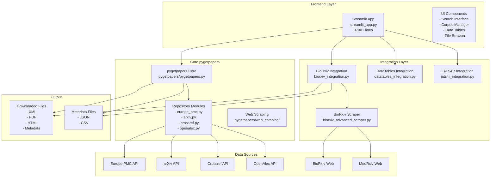
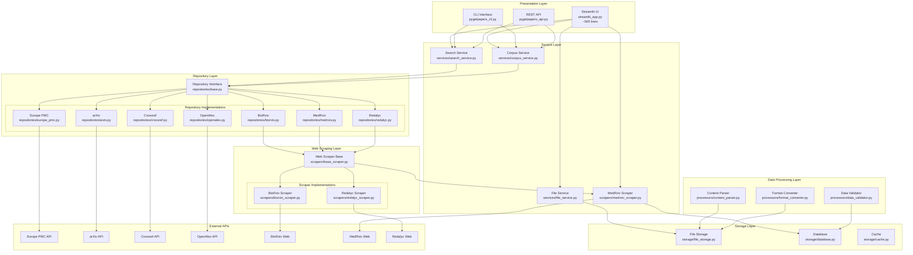

# Pygetpapers Architecture

## Current Architecture (v1.x)



## Current Issues

### 1. **Monolithic Streamlit App**
- `streamlit_app.py` is 3700+ lines
- Contains UI, business logic, and data processing
- Difficult to maintain and test
- Violates single responsibility principle

### 2. **Scattered BioRxiv Code**
- `biorxiv_advanced_scraper.py` - Core scraping logic
- `biorxiv_integration.py` - Integration layer
- `biorxiv_web_scraper.py` - Alternative implementation
- No clear separation of concerns

### 3. **No Common Repository Interface**
- Each repository (Europe PMC, arXiv, etc.) has different implementations
- No unified interface for different data sources
- Duplicate code across repositories

### 4. **Missing Abstraction Layers**
- Direct coupling between UI and data sources
- No service layer for business logic
- No data access layer

## Proposed Architecture (v2.0)



## Migration Plan

### Phase 1: Extract Services (v1.1)
```python
# services/search_service.py
class SearchService:
    def search_papers(self, query: str, repository: str, **kwargs):
        pass

# services/corpus_service.py
class CorpusService:
    def create_corpus(self, papers: List[Paper]):
        pass
    
    def get_corpus_stats(self, corpus_id: str):
        pass
```

### Phase 2: Repository Interface (v1.2)
```python
# repositories/base.py
class BaseRepository(ABC):
    @abstractmethod
    def search(self, query: str, **kwargs) -> List[Paper]:
        pass
    
    @abstractmethod
    def download_paper(self, paper_id: str) -> Paper:
        pass

# repositories/biorxiv.py
class BioRxivRepository(BaseRepository):
    def __init__(self):
        self.scraper = BioRxivScraper()
    
    def search(self, query: str, **kwargs) -> List[Paper]:
        return self.scraper.search(query, **kwargs)
```

### Phase 3: Web Scraper Base (v1.3)
```python
# scrapers/base_scraper.py
class BaseWebScraper(ABC):
    @abstractmethod
    def search(self, query: str, **kwargs) -> List[Paper]:
        pass
    
    @abstractmethod
    def extract_paper_data(self, html: str) -> Paper:
        pass

# scrapers/biorxiv_scraper.py
class BioRxivScraper(BaseWebScraper):
    def search(self, query: str, **kwargs) -> List[Paper]:
        # Implementation
        pass
```

### Phase 4: Data Processing Layer (v1.4)
```python
# processors/content_parser.py
class ContentParser:
    def parse_xml(self, xml_content: str) -> Dict:
        pass
    
    def parse_html(self, html_content: str) -> Dict:
        pass

# processors/format_converter.py
class FormatConverter:
    def xml_to_html(self, xml_content: str) -> str:
        pass
    
    def html_to_text(self, html_content: str) -> str:
        pass
```

### Phase 5: Storage Layer (v1.5)
```python
# storage/file_storage.py
class FileStorage:
    def save_paper(self, paper: Paper, directory: str):
        pass
    
    def get_paper_files(self, paper_id: str) -> List[str]:
        pass

# storage/database.py
class Database:
    def save_metadata(self, metadata: Dict):
        pass
    
    def get_corpus_metadata(self, corpus_id: str) -> Dict:
        pass
```

## Benefits of New Architecture

### 1. **Modularity**
- Each component has a single responsibility
- Easy to test individual components
- Clear separation of concerns

### 2. **Extensibility**
- Easy to add new repositories
- Easy to add new scrapers
- Easy to add new data processing steps

### 3. **Maintainability**
- Smaller, focused files
- Clear interfaces between components
- Easier to debug and fix issues

### 4. **Reusability**
- Common interfaces for similar functionality
- Shared utilities and helpers
- Consistent patterns across the codebase

### 5. **Testability**
- Each layer can be tested independently
- Mock external dependencies easily
- Clear input/output contracts

## Implementation Guidelines

### 1. **File Structure**
```
pygetpapers/
├── services/           # Business logic
├── repositories/       # Data source interfaces
├── scrapers/          # Web scraping implementations
├── processors/        # Data processing
├── storage/           # Data persistence
├── ui/                # User interfaces
│   ├── streamlit_app.py
│   ├── cli.py
│   └── api.py
├── utils/             # Shared utilities
└── tests/             # Test files
```

### 2. **Naming Conventions**
- Use descriptive names for classes and methods
- Follow Python naming conventions
- Use type hints consistently

### 3. **Error Handling**
- Use custom exceptions for different error types
- Provide meaningful error messages
- Log errors appropriately

### 4. **Configuration**
- Use configuration files for settings
- Support environment variables
- Provide sensible defaults

### 5. **Documentation**
- Document all public interfaces
- Provide usage examples
- Keep architecture diagrams updated

## Migration Strategy

1. **Incremental Migration**: Move components one at a time
2. **Backward Compatibility**: Maintain existing interfaces during transition
3. **Testing**: Write tests for new components before migrating
4. **Documentation**: Update documentation as components are migrated
5. **Validation**: Ensure functionality remains the same after migration

This architecture will make pygetpapers more maintainable, extensible, and professional while preserving all existing functionality. 