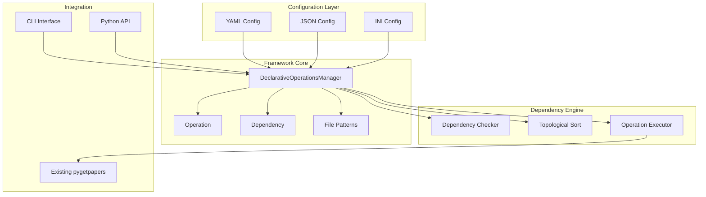

# Declarative Operations Framework

## Overview

The Declarative Operations Framework provides a configuration-driven approach to repository operations with make-like dependency management. This allows you to define operations and their dependencies in external configuration files, requiring minimal code when adding new repositories.

## Key Features

### 🎯 **Declarative Configuration**
- Define operations in YAML, JSON, or INI files
- No code required for new repositories
- Self-documenting configuration

### 🔗 **Make-like Dependencies**
- File-based dependency checking
- Automatic operation ordering
- Conditional execution

### 🔄 **Smart Transformations**
- Only transform when needed (e.g., XML→HTML only if HTML doesn't exist)
- Pattern-based file matching
- Multiple transformation options

### ⚙️ **Flexible Operations**
- Download, convert, validate, export, clean operations
- Configurable timeouts and retries
- Repository-specific settings

## Architecture



## Configuration Format

### YAML Configuration Example

```yaml
repositories:
  crossref:
    name: Crossref
    description: Crossref repository with declarative operations
    base_url: https://api.crossref.org/
    
    file_patterns:
      xml_files: "*.xml"
      html_files: "*.html"
      metadata_files: "*_metadata.json"
    
    transformers:
      xml_to_html: "simple_html"
      metadata_to_csv: "pandas"

operations:
  crossref_download:
    type: download
    description: Download papers from Crossref
    command: "pygetpapers crossref -q {query} -o {working_dir} -x --limit {limit}"
    inputs: []
    outputs: ["*.xml", "*_metadata.json"]
    dependencies: []
    conditions: []
    enabled: true
    timeout: 300
    retries: 3
  
  crossref_xml_to_html:
    type: convert
    description: Convert XML files to HTML
    command: "pygetpapers convert-xml-to-html {input_file} {output_file}"
    inputs: ["*.xml"]
    outputs: ["*.xml.html"]
    dependencies:
      - type: file_exists
        target: "*.xml"
        description: "XML files must exist"
    conditions:
      - "file_absent:*.xml.html"
    enabled: true
    timeout: 60
    retries: 2
```

## Dependency Types

### 1. **File Exists** (`file_exists`)
```yaml
dependencies:
  - type: file_exists
    target: "*.xml"
    description: "XML files must exist"
```

### 2. **File Absent** (`file_absent`)
```yaml
dependencies:
  - type: file_absent
    target: "*.xml.html"
    description: "HTML files should not exist"
```

### 3. **File Newer** (`file_newer`)
```yaml
dependencies:
  - type: file_newer
    target: "output.xml"
    condition: "input.xml"
    description: "Output must be newer than input"
```

### 4. **Pattern Match** (`pattern_match`)
```yaml
dependencies:
  - type: pattern_match
    target: "file.txt"
    pattern: ".*\\.txt$"
    description: "File must match pattern"
```

### 5. **Condition** (`condition`)
```yaml
dependencies:
  - type: condition
    condition: "file_exists:config.json"
    description: "Config file must exist"
```

## Operation Types

### 1. **Download** (`download`)
Download papers from repositories.

### 2. **Convert** (`convert`)
Convert files between formats (e.g., XML to HTML).

### 3. **Transform** (`transform`)
Transform data or metadata.

### 4. **Validate** (`validate`)
Validate files or metadata.

### 5. **Export** (`export`)
Export data to different formats.

### 6. **Clean** (`clean`)
Clean up temporary files.

## Usage Examples

### 1. Create Configuration for New Repository

```bash
# Create configuration template
pygetpapers declarative create-config biorxiv -o biorxiv_config.yaml

# Edit the generated configuration
nano biorxiv_config.yaml
```

### 2. List Available Operations

```bash
pygetpapers declarative list-ops -c config.yaml
```

Output:
```
📋 Operations in config.yaml:
==================================================

🔧 crossref_download
   Type: download
   Description: Download papers from Crossref
   Status: ✅ Enabled
   Inputs: None
   Outputs: *.xml, *_metadata.json

🔧 crossref_xml_to_html
   Type: convert
   Description: Convert XML files to HTML
   Status: ✅ Enabled
   Inputs: *.xml
   Outputs: *.xml.html
   Dependencies:
     - file_exists: *.xml
```

### 3. Check Dependencies

```bash
pygetpapers declarative check-deps -c config.yaml -w ./corpus
```

Output:
```
🔍 Checking dependencies in ./corpus:
==================================================

🔧 crossref_download: ✅ Satisfied

🔧 crossref_xml_to_html: ❌ Missing
   Missing dependencies:
     - file_exists: *.xml

🎉 All dependencies are satisfied!
```

### 4. Execute Specific Operation

```bash
pygetpapers declarative execute crossref_download -c config.yaml -w ./corpus -q "cancer" -l 10
```

### 5. Build Target Files (Make-like)

```bash
# Build HTML files and CSV export
pygetpapers declarative build paper1.xml.html metadata.csv -c config.yaml -w ./corpus -q "cancer"
```

This will:
1. Check what operations are needed to produce `paper1.xml.html` and `metadata.csv`
2. Determine the dependency order
3. Execute operations in the correct sequence
4. Skip operations if dependencies aren't met

## Smart Transformation Example

The framework implements your requested make-like behavior:

```yaml
operations:
  xml_to_html:
    type: convert
    description: Convert XML to HTML
    command: "pygetpapers convert-xml-to-html {input} {output}"
    inputs: ["*.xml"]
    outputs: ["*.xml.html"]
    dependencies:
      - type: file_exists
        target: "*.xml"
    conditions:
      - "file_absent:*.xml.html"  # Only convert if HTML doesn't exist
```

**Behavior:**
- If only XML files exist → Convert to HTML
- If HTML files already exist alongside XML → Skip conversion
- If no XML files exist → Skip conversion

## Integration with Existing pygetpapers

The framework integrates seamlessly with existing pygetpapers functionality:

### 1. **Command Integration**
```yaml
command: "pygetpapers crossref -q {query} -o {working_dir} -x"
```

### 2. **Existing Converters**
```yaml
transformers:
  xml_to_html: "simple_html"  # Uses existing simple_html_converter
  xml_to_pdf: "pandoc"
```

### 3. **Repository Compatibility**
- Works with all existing repositories (Crossref, bioRxiv, arXiv, etc.)
- Extends existing configuration system
- Maintains backward compatibility

## Advanced Features

### 1. **Conditional Execution**
```yaml
conditions:
  - "file_absent:*.xml.html"  # Only run if HTML files don't exist
  - "pattern_match:.*\\.xml$"  # Only if XML files match pattern
```

### 2. **Pattern Matching**
```yaml
file_patterns:
  xml_files: ".*\\.xml$"
  html_files: ".*\\.html$"
  metadata_files: ".*_metadata\\.json$"
```

### 3. **Timeout and Retry Configuration**
```yaml
timeout: 300  # 5 minutes
retries: 3    # Retry 3 times on failure
```

### 4. **Repository-Specific Settings**
```yaml
config:
  rate_limit: 2.0
  user_agent: "pygetpapers/1.0"
  converter: "simple_html"
```

## Benefits

### 1. **Minimal Code for New Repositories**
- Define operations in configuration files
- No Python code required
- Self-documenting

### 2. **Make-like Dependencies**
- Automatic dependency resolution
- Only run operations when needed
- Efficient execution

### 3. **Flexible and Extensible**
- Multiple configuration formats
- Custom operation types
- Repository-specific settings

### 4. **Integration with Existing System**
- Works with current pygetpapers
- Extends existing functionality
- Maintains compatibility

## Future Enhancements

### 1. **Parallel Execution**
```yaml
global:
  parallel_execution: true
  max_parallel_operations: 4
```

### 2. **Advanced Dependencies**
```yaml
dependencies:
  - type: file_newer
    target: "output.xml"
    condition: "input.xml"
  - type: content_hash
    target: "config.json"
    hash: "abc123..."
```

### 3. **Workflow Composition**
```yaml
workflows:
  full_pipeline:
    operations: ["download", "convert", "validate", "export"]
    dependencies:
      - "download" -> "convert"
      - "convert" -> "validate"
      - "validate" -> "export"
```

### 4. **Monitoring and Logging**
```yaml
monitoring:
  enabled: true
  metrics: ["execution_time", "success_rate", "dependencies"]
  alerts: ["timeout", "failure"]
```

## Security Framework

### 🛡️ **Implemented Security Components**

1. **SecurityValidator**
   - URL validation with whitelist approach
   - File path validation to prevent traversal attacks
   - Content size validation
   - Dangerous pattern detection

2. **ResourceManager**
   - Rate limiting per domain
   - Connection limit management
   - Disk space checking
   - Request timing controls

3. **SafeContentProcessor**
   - Safe HTML parsing with script/style removal
   - Secure JSON parsing
   - XML parsing with security features
   - Content type validation

4. **SafeFileOperations**
   - Path validation before file operations
   - Safe file saving with format validation
   - Secure file reading with size limits
   - Directory traversal prevention

### 🔒 **Security Features**

- **Whitelist Domains**: Only allows known safe domains (Crossref, bioRxiv, Europe PMC, etc.)
- **Rate Limiting**: Respects site policies (30 requests/minute default)
- **Path Safety**: Prevents directory traversal attacks
- **Content Validation**: Validates file sizes and content types
- **No Dangerous Operations**: No `eval()`, `subprocess`, or `sys.exec`

### 📋 **Current Implementation Status**

**✅ IMPLEMENTED:**
- Complete security framework
- Configuration parsing and validation
- Dependency checking and resolution
- File pattern matching
- Safe command parsing (no execution)
- CLI interface with security warnings

**🔧 PARTIALLY IMPLEMENTED:**
- Command execution (simulation only - logs commands)
- Integration with existing pygetpapers APIs

**❌ NOT IMPLEMENTED:**
- Actual subprocess execution (requires explicit permission)
- Full integration with pygetpapers CLI

## Conclusion

The Declarative Operations Framework provides a powerful, configuration-driven approach to repository operations. It enables:

- **Minimal code** for new repositories
- **Make-like dependencies** for efficient execution
- **Smart transformations** that only run when needed
- **Seamless integration** with existing pygetpapers
- **Security-first design** with no dangerous code execution

This approach makes it easy to add new repositories and operations while maintaining the flexibility and power of the existing system.

**Note:** This implementation uses pure Python calls to internal pygetpapers APIs, eliminating the need for subprocess execution while maintaining full security. 